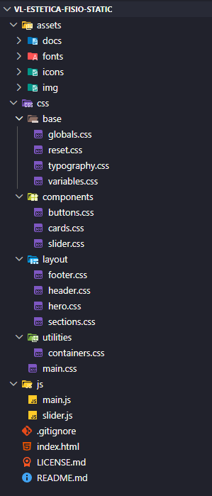

# VL Estética & Fisioterapia – Static Frontend Landing Page

---

# 🇧🇷 PT-BR

## 📌 Sobre o projeto

Este projeto consiste na versão **frontend estática institucional** da landing page da clínica **VL Estética & Fisioterapia**.

O foco desta aplicação é fornecer uma experiência moderna, responsiva, performática e acessível, utilizando exclusivamente tecnologias frontend.

Esta versão foi desenvolvida para deploy estático via GitHub Pages e serve como base visual independente da futura aplicação backend.

---

## 🎯 Objetivos

- Criar uma landing page moderna e responsiva
- Garantir alta performance e carregamento rápido
- Estruturar CSS modular e escalável
- Implementar UX fluida com animações suaves
- Facilitar conversão via contato direto
- Manter arquitetura frontend limpa e reutilizável

---

## 🧱 Arquitetura do projeto

A estrutura de pastas segue organização modular para separação de responsabilidades e manutenção escalável.

> 📌 A estrutura visual completa está documentada no print da arquitetura do projeto.

### Organização geral

- `/css`
  - base (reset, variables, typography, globals)
  - layout (header, footer, grid)
  - components (buttons, cards, slider)
  - sections (hero, services, testimonials, team)
  - utils (containers, spacing, helpers)

- `/js`
  - main.js (lógica global do frontend)
  - slider.js (carrossel de serviços)
  - modules futuros (animações e acessibilidade)

- `/assets`
  - imagens otimizadas WebP
  - ícones
  - mídia geral

---

## ⚙️ Tecnologias utilizadas

- HTML5 semântico
- CSS3 moderno
- Flexbox + CSS Grid
- JavaScript Vanilla
- AOS (Animate On Scroll)
- Google Fonts
- WebP Optimization
- Arquitetura CSS modular

---

## 🎨 Features

- Header fixo responsivo
- Menu mobile acessível (ARIA)
- Slider automático de serviços
- Seção de equipe responsiva
- Grid de depoimentos
- CTA focada em conversão
- Integração com Google Maps
- Footer completo com navegação e contatos
- Scroll animations leves

---

## 📱 Responsividade

O projeto utiliza abordagem mobile-first com adaptação para:

- Smartphones
- Tablets
- Notebooks
- Monitores Full HD+

---

## 🚀 Performance

- Lazy loading de imagens
- Uso de WebP
- JavaScript leve sem frameworks
- CSS modularizado
- Estrutura otimizada para carregamento rápido
- Baixo acoplamento entre componentes

---

## 🧠 Decisões técnicas

- Separação modular de CSS
- JavaScript Vanilla para maior performance
- Estrutura desacoplada do backend
- Organização escalável de assets
- Componentização visual reutilizável

---

## 🌐 Deploy

Este projeto foi estruturado para deploy frontend estático utilizando:

- GitHub Pages
- Hospedagem estática CDN
- Deploy simples sem backend integrado

---

## 🔮 Expansões futuras

A arquitetura visual poderá futuramente integrar:

- Backend PHP
- APIs externas
- Sistema de agendamento
- Formulários dinâmicos
- Painel administrativo

Essas funcionalidades serão mantidas em um repositório/backend separado.

---

## 📸 Interface

A interface segue arquitetura visual modular focada em experiência moderna, acessibilidade e conversão.

---

## 📬 Contato

Projeto desenvolvido para fins institucionais e profissionais.

---

---

# 🇺🇸 ENGLISH

## 📌 About the project

This project represents the **static institutional frontend version** of the landing page for **VL Estética & Fisioterapia**.

The application focuses on delivering a modern, responsive, performant, and accessible frontend experience using only frontend technologies.

This version was designed for static deployment through GitHub Pages and works independently from any future backend implementation.

---

## 🎯 Goals

- Build a modern responsive landing page
- Ensure high performance and fast loading
- Create scalable modular CSS architecture
- Implement smooth UX animations
- Improve direct contact conversion
- Maintain reusable frontend architecture

---

## 🧱 Project architecture

The folder structure follows a modular organization focused on scalability and maintainability.

> 📌 The full visual structure is documented in the project architecture screenshot.

### General structure

- `/css`
  - base (reset, variables, typography, globals)
  - layout (header, footer, grid)
  - components (buttons, cards, slider)
  - sections (hero, services, testimonials, team)
  - utils (containers, spacing, helpers)

- `/js`
  - main.js (global frontend logic)
  - slider.js (services carousel)
  - future modules (animations and accessibility)

- `/assets`
  - optimized WebP images
  - icons
  - media assets

---

## ⚙️ Tech stack

- Semantic HTML5
- Modern CSS3
- Flexbox + CSS Grid
- Vanilla JavaScript
- AOS (Animate On Scroll)
- Google Fonts
- WebP Optimization
- Modular CSS architecture

---

## 🎨 Features

- Fixed responsive header
- Accessible mobile menu (ARIA)
- Automatic services slider
- Responsive team section
- Testimonials grid
- Conversion-focused CTA
- Google Maps integration
- Full footer navigation
- Lightweight scroll animations

---

## 📱 Responsiveness

Mobile-first approach supporting:

- Smartphones
- Tablets
- Laptops
- Full HD+ displays

---

## 🚀 Performance

- Lazy-loaded images
- WebP image optimization
- Lightweight Vanilla JS
- Modular CSS structure
- Fast-loading architecture
- Low component coupling

---

## 🧠 Technical decisions

- Modular CSS architecture
- Vanilla JS for performance
- Backend-independent structure
- Scalable asset organization
- Reusable visual components

---

## 🌐 Deployment

This project was designed for static frontend deployment using:

- GitHub Pages
- Static CDN hosting
- Simple deployment without backend integration

---

## 🔮 Future expansions

The visual architecture may later integrate:

- PHP backend
- External APIs
- Appointment scheduling system
- Dynamic forms
- Administrative dashboard

These features will live in a separate backend repository.

---

## 📸 UI Reference

The UI architecture follows a modular system focused on accessibility, performance, and conversion.

---

## 📬 Contact

Project built for professional and institutional purposes.